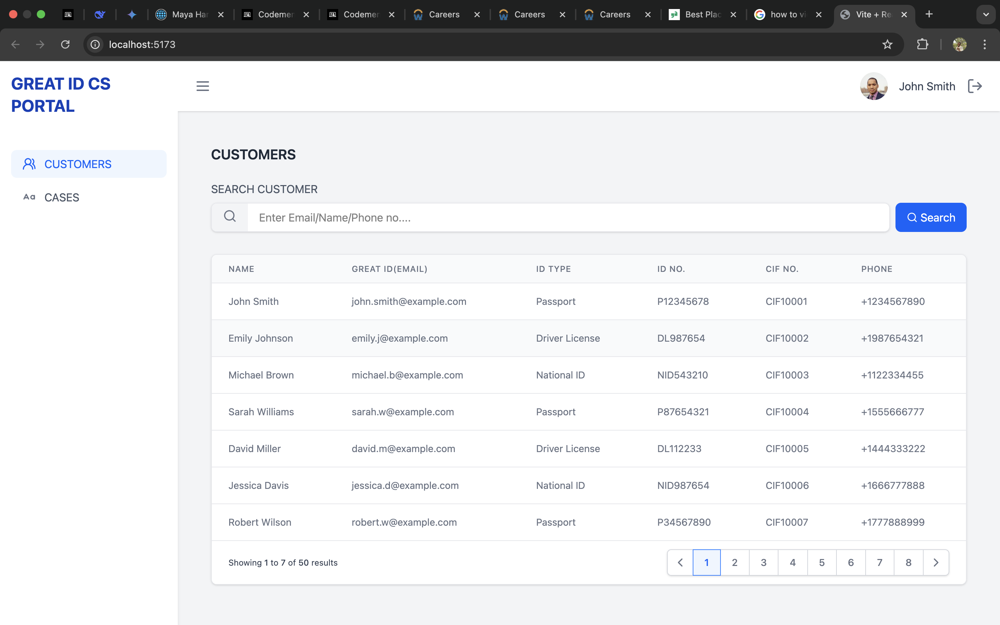
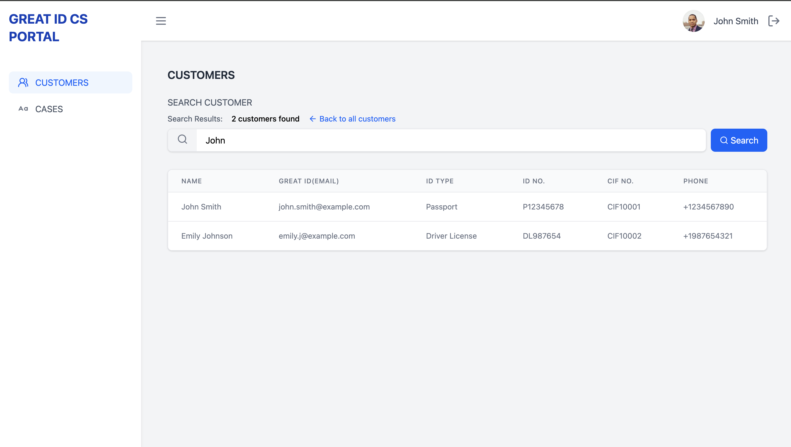
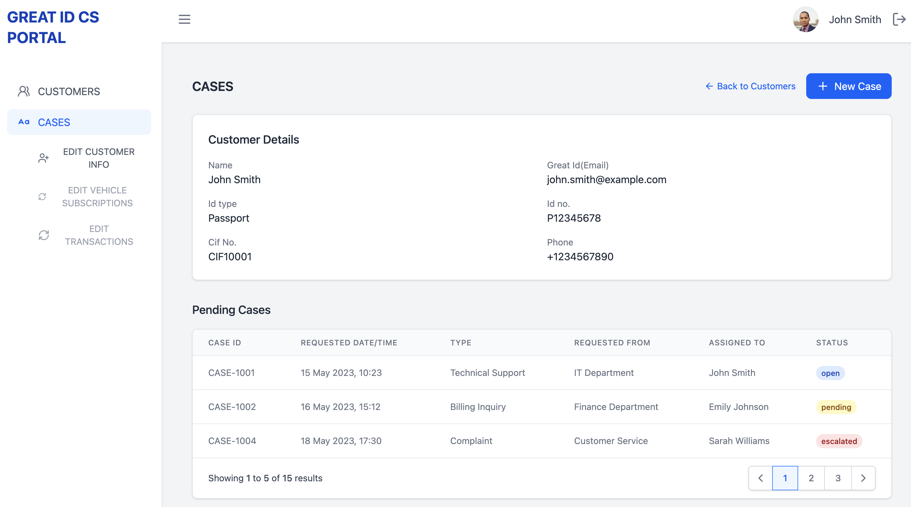
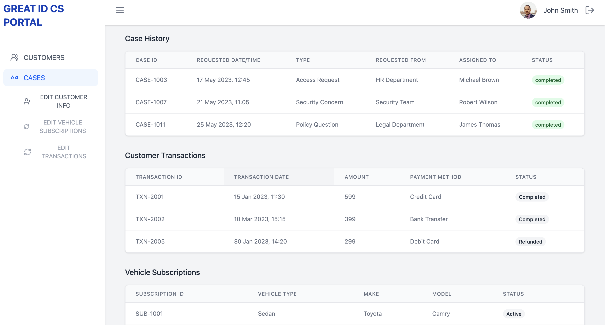
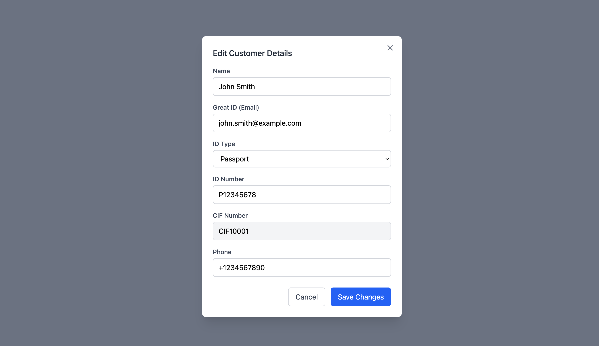

# 🚀 React + Vite + TailwindCSS4 Project

 _Optional: Add a banner image if available_

A modern web application built with React, Vite, and TailwindCSS featuring customer management functionality.

## 📋 Table of Contents

- [Features](#-features)
- [Installation](#-installation)
- [Usage](#-usage)
- [Screenshots](#-screenshots)
- [Technology Stack](#-technology-stack)
- [Contributing](#-contributing)

## 🌟 Features

- Customer list view with pagination
- Advanced search functionality
- Case management system
- Interactive modal dialogs
- Responsive TailwindCSS design
- Fast Vite development environment

## 🛠 Installation

### Prerequisites

- Node.js (v16 or later recommended)
- npm (v9 or later)

1. Clone the repository:
   ```bash
   git clone https://github.com/your-username/your-repo.git
   cd your-repo
   Install dependencies:
   ```

bash
Copy
npm install
Start the development server:

bash
Copy
npm run dev
Open your browser at http://localhost:5173/

🖥 Usage
After starting the development server:

Browse customers on the homepage

Use the search functionality to find specific customers

View and manage cases

Interact with modal dialogs

📸 Screenshots
Homepage / Customers List
Customers List Pagez


Search Functionality
Search Feature


Cases Management
Cases Overview


Cases Data Table


Modal Dialog
Modal Window


💻 Technology Stack
React
Vite
TailwindCSS
JavaScript

🤝 Contributing
Contributions are welcome! Please follow these steps:

Fork the project

Create your feature branch (git checkout -b feature/AmazingFeature)

Commit your changes (git commit -m 'Add some AmazingFeature')

Push to the branch (git push origin feature/AmazingFeature)

Open a Pull Request
